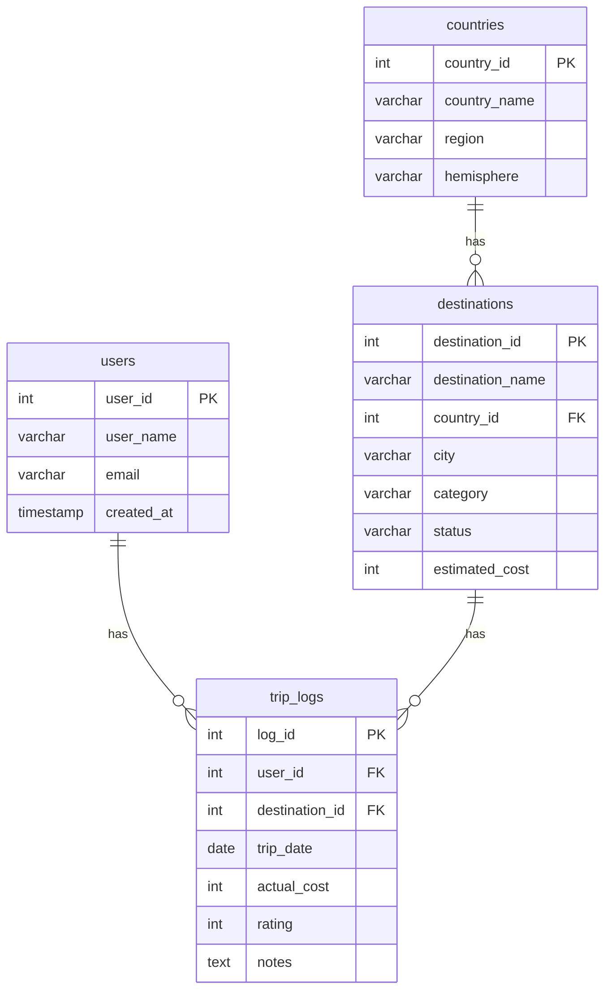

# 夢の旅行先データベース (Dream Destinations DB)

## 1. プロジェクト概要

このプロジェクトは、SQLの学習成果物として作成した、個人の旅行先や旅行記録を管理するためのデータベースです。

基本的なデータ操作（CRUD）から、テーブル結合、サブクエリ、ウィンドウ関数を用いた集計・分析まで、SQLの幅広いスキルを実践することを目的としています。


## 2. ER図

各テーブルの関係性は以下の通りです。


*(このER図はGitHub上で自動的に図として表示されます)*


## 3. テーブル設計

このデータベースは、以下の4つのテーブルで構成されています。

| テーブル名 | 概要 |
| :--- | :--- |
| `countries` | 国の基本情報（地域、半球など）を管理します。 |
| `destinations` | 行きたい場所や行った場所の詳細情報（カテゴリ、予算など）を管理します。 |
| `users` | このデータベースを利用するユーザーの情報を管理します。 |
| `trip_logs` | ユーザーの実際の旅行記録（日付、費用、評価など）を管理します。 |


## 4. Showcase Queries（クエリ紹介）

このデータベースから価値ある情報を引き出すための、代表的なクエリを紹介します。

### クエリ1：国別の予算ランキング

**目的:** 各国の中で、どの旅行先の想定予算が最も高いか、ランキング形式で可視化します。
```sql
-- ここに、ウィンドウ関数を使ったクエリのコードを貼り付けてください
SELECT
    des.destination_name,
    con.country_name,
    des.estimated_cost,
    RANK() OVER (PARTITION BY con.country_name ORDER BY des.estimated_cost DESC) AS cost_rank
FROM
    destinations des
JOIN
    countries con ON con.country_id = des.country_id;
```


## 5. 使用技術
- **データベース:** MySQL 8.0